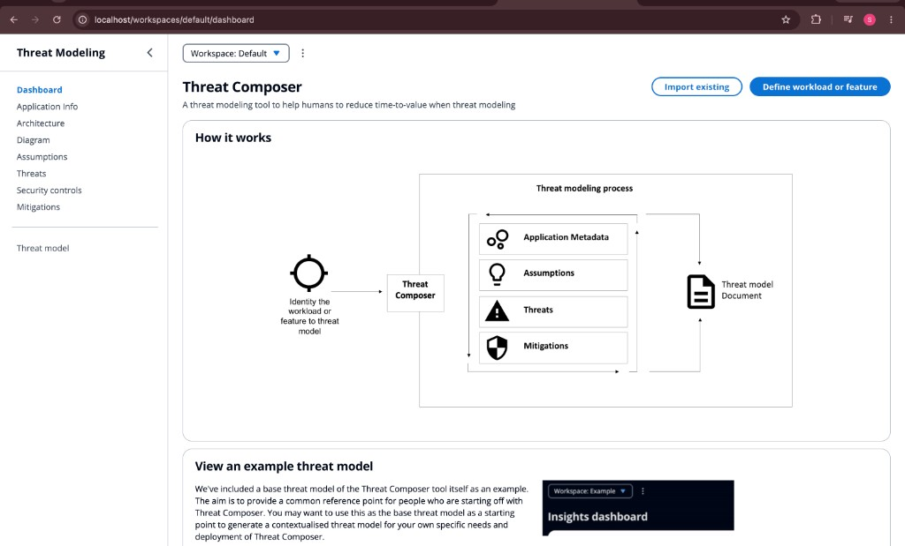
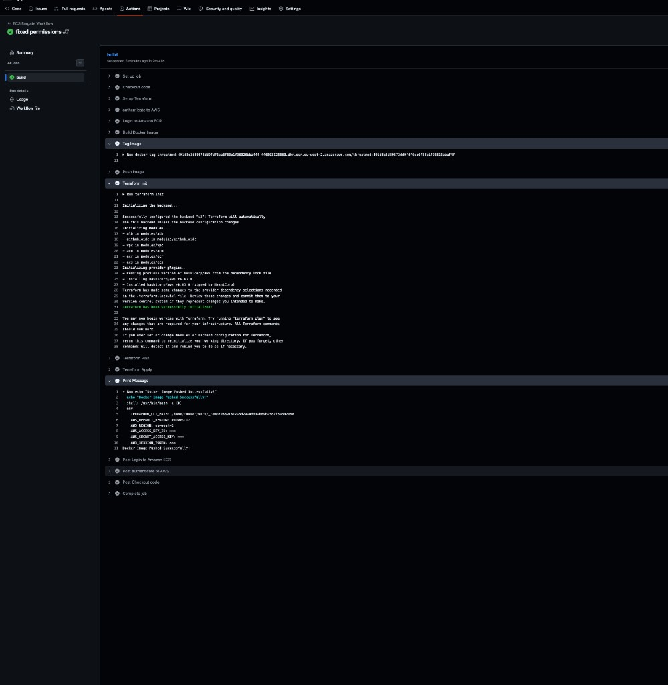

# ECS Fargate CI/CD Pipeline with Terraform, Docker & GitHub Actions
An end-to-end container deployment project that packages an application
with Docker, provisions AWS infrastructure with Terraform, and
automatically deploys new application versions to Amazon ECS Fargate
through GitHub Actions.

The pipeline uses GitHub OIDC federation with AWS IAM instead of
long-lived AWS access keys, tags Docker images with the Git commit
SHA, stores them in Amazon ECR, and deploys the exact image
version through a new ECS task definition revision.

# Project Overview
This project demonstrates how the main pieces of a production-style
container deployment fit together:

Docker containerises the application.

Amazon ECR stores versioned container images.

Terraform manages the AWS infrastructure as code.

GitHub Actions provides the CI/CD workflow.

GitHub OIDC + AWS IAM provides keyless CI/CD authentication.

Amazon ECS with AWS Fargate runs the container without managing
EC2 instances.

Application Load Balancer (ALB) routes traffic to healthy ECS
tasks.

Route 53 and AWS Certificate Manager (ACM) provide the custom
domain and HTTPS.

Amazon CloudWatch Logs receives container logs.

Amazon S3 stores the Terraform remote state.

# Live Deployment
The containerised application is deployed to ECS Fargate and served over HTTPS at [tm.shabnamkhan.tech](https://tm.shabnamkhan.tech).

# AWS Infrastructure
The infrastructure is managed with Terraform and organised into reusable
modules.

Terraform
├── VPC
│   ├── Subnets
│   ├── Route tables
│   ├── Internet gateway
│   └── Security groups
├── Application Load Balancer
│   └── Target group
├── Amazon ECR
├── Amazon ECS
│   ├── ECS cluster
│   ├── Task definition
│   └── ECS service
├── CloudWatch Logs
├── Route 53
├── ACM certificate
├── S3 Terraform backend
└── GitHub OIDC / IAM

The ECS workload uses the Fargate launch type and the awsvpc network
mode. The application container listens on port 8080.

# CI/CD Pipeline
A push to the main branch starts the GitHub Actions workflow.

The deployment flow is:

Check out the repository.

Authenticate GitHub Actions to AWS using OIDC.

Authenticate Docker to Amazon ECR.

Build the Docker image.

Tag the image with the Git commit SHA.

Push the image to ECR.

Pass the SHA to Terraform as image_tag.

Run terraform plan.

Run terraform apply.

Register a new ECS task definition revision.

Update the ECS service.

ECS/Fargate starts the new task and replaces the previous task.

The ALB routes traffic to the healthy deployment.

A successful pipeline run builds the Docker image, pushes to ECR, and applies Terraform to roll out the new ECS task definition:

# Secure AWS Authentication with GitHub OIDC
The pipeline does not require permanent AWS access keys stored in
GitHub.

An AWS IAM OIDC identity provider trusts:

https://token.actions.githubusercontent.com

GitHub Actions uses its OIDC token to assume the dedicated deployment
role:

threatmod-github-actions-iam-role

The trust relationship is restricted to the intended GitHub
repository/branch.

This provides short-lived AWS credentials to the workflow rather than
maintaining long-lived IAM user credentials.

# Key Lessons
This project provided hands-on experience with more than simply running
a Docker container.

It demonstrated how to:

Containerise an application and run it on ECS Fargate.

Build AWS infrastructure from Terraform modules.

Connect an ECS service to an Application Load Balancer.

Implement HTTPS using Route 53 and ACM.

Build an automated GitHub Actions deployment pipeline.

Authenticate GitHub Actions to AWS securely with OIDC.

Design IAM permissions for both deployment actions and Terraform
state refreshes.

Use Git commit SHAs for immutable Docker image versioning.

Connect a specific source commit to a specific ECS deployment.

Diagnose container startup failures using CloudWatch Logs.

Handle container CPU architecture compatibility.

Maintain Terraform state remotely in S3.

